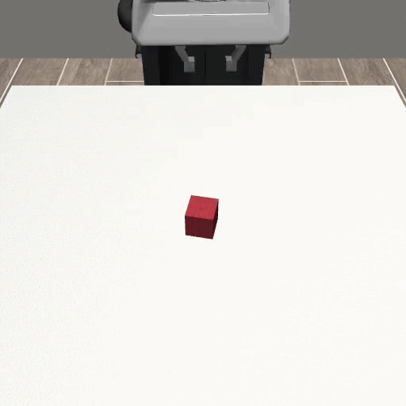
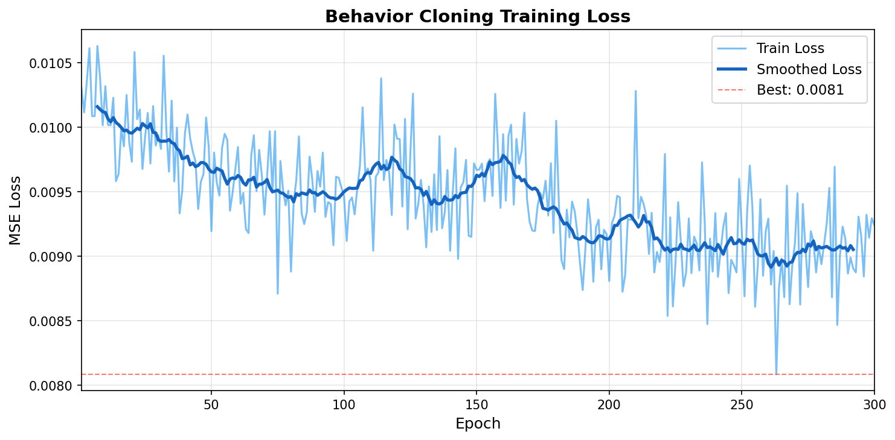

# Behavior Cloning for Robot Manipulation

Imitation learning pipeline implementing Behavior Cloning (BC) for a robotic object lifting task using [Robosuite](https://robosuite.ai/) and PyTorch. Built to understand the core robot learning methodology used in surgical autonomy research — specifically the approach taken in [Orbit-Surgical](https://orbit-surgical.github.io/) and [SuFIA-BC](https://orbit-surgical.github.io/sufia-bc/).


---

## Demo



> Learned BC policy successfully lifting the cube — **80% success rate** over 20 evaluation episodes.

---

## Overview

This project implements the full behavior cloning pipeline from scratch:

```
Scripted Expert Policy
        │
        ▼
Demo Collection ──► HDF5 dataset of (observation, action) pairs
        │
        ▼
BC Training ──► MLP policy trained via supervised learning (MSE loss)
        │
        ▼
Policy Evaluation ──► success rate over unseen episodes
```

The pipeline mirrors the core methodology of Orbit-Surgical and SuFIA-BC, where scripted expert demonstrations are used to train imitation learning policies for surgical subtasks. The key difference is the simulation environment (Robosuite vs Isaac Lab) and robot platform (Franka Panda vs dVRK PSM).

---

## Results

| Experiment | Demos | Obs Normalization | Noise Injection | Success Rate |
|---|---|---|---|---|
| Baseline | 50 | ✗ | ✗ | 0% |
| + Normalization | 200 | ✓ | ✗ | 15% |
| **+ Noise Injection** | **500** | **✓** | **✓** | **80%** |

### Training Loss Curve



Loss converges from ~0.010 → ~0.009 over 300 epochs. The flat convergence after epoch 100 is characteristic of BC on state-based observations — further gains require more data diversity or architectural changes.

---

## Key Findings

**1. Distribution shift is the primary failure mode**
BC is trained on demonstrations from a fixed distribution. At inference, small positional errors compound — a slight deviation in gripper position leads to incorrect grasp timing, causing task failure. This is the fundamental limitation of vanilla BC, addressed by methods like DAgger.

**2. Observation normalization is critical**
Raw observations span very different scales: `eef_pos` (~0.8) vs `gripper_qpos` (~0.001). Without normalization, large-scale features dominate gradients and the policy becomes blind to gripper state — causing the gripper to remain open throughout execution.

**3. Noise injection improves robustness**
Adding Gaussian noise (σ=0.02) to expert actions during collection exposes the policy to slightly perturbed states, reducing the distribution gap between training and evaluation. This alone improved success rate from 15% → 80%.

---

## Project Structure

```
behavior-cloning-robot-manipulation/
├── scripts/
│   ├── collect_demos.py     # scripted expert policy + HDF5 demo collection
│   ├── train_bc.py          # BC training with obs normalization
│   ├── evaluate_bc.py       # policy evaluation over N episodes
│   └── record_video.py      # record rollout as video/GIF
├── assets/
│   └── training_curve.png   # loss curve visualization
├── results/
│   └── demo.gif             # policy rollout demo
├── .gitignore
└── README.md
```

---

## Setup

```bash
# Create and activate environment
conda create -n imitation_learning python=3.10 -y
conda activate imitation_learning

# Install dependencies
pip install robosuite
pip install robomimic --no-deps
pip install h5py psutil tqdm termcolor tensorboard tensorboardX \
            imageio imageio-ffmpeg matplotlib torch torchvision
```

> **Note:** `egl_probe` installation will fail on Windows — this is expected and does not affect functionality. Robomimic is installed with `--no-deps` to skip this Linux-only dependency.

---

## Usage

### 1. Collect Expert Demonstrations
```bash
python scripts/collect_demos.py
```
Runs a scripted 4-phase expert policy (Reach → Descend → Grasp → Lift) with Gaussian noise injection (σ=0.02). Only successful episodes are saved to `data/demos.hdf5`.

### 2. Train BC Policy
```bash
python scripts/train_bc.py
```
Trains a 3-layer MLP on the collected demonstrations. Observations are normalized using training set mean and std. Best checkpoint saved to `results/bc_policy.pth`.

### 3. Evaluate
```bash
python scripts/evaluate_bc.py
```
Runs the learned policy over 20 episodes and reports success rate and average episode length.

### 4. Record Demo
```bash
python scripts/record_video.py
```
Records policy rollouts using the offscreen renderer and saves to `results/demo.mp4`.

---

## Architecture

**Policy Network:** 3-layer MLP
```
Input (15) → Linear(256) → ReLU → Linear(256) → ReLU → Linear(256) → ReLU → Linear(7) → Tanh
```

**Observation Space (15-dim):**

| Feature | Dim | Description |
|---|---|---|
| `robot0_eef_pos` | 3 | End-effector position (x, y, z) |
| `robot0_eef_quat` | 4 | End-effector orientation (quaternion) |
| `robot0_gripper_qpos` | 2 | Gripper joint positions (open/close state) |
| `cube_pos` | 3 | Target object position |
| `gripper_to_cube_pos` | 3 | Relative vector: gripper → object |

**Action Space (7-dim):** OSC_POSE delta commands `[dx, dy, dz, dax, day, daz, gripper]`

**Training Configuration:**

| Parameter | Value |
|---|---|
| Loss | MSE |
| Optimizer | Adam |
| Learning rate | 1e-3 |
| Epochs | 300 |
| Batch size | 256 |
| Dataset | 500 demos, 36,469 timesteps |

---

## Limitations & Future Work

- **Distribution shift** — vanilla BC compounds errors at inference. DAgger would iteratively collect data at failure states to address this systematically.
- **State-based observations only** — visual BC (RGB / point cloud input) is more relevant to real surgical settings, as explored in SuFIA-BC which evaluates multi-view cameras and depth representations.
- **Single-arm, simple task** — surgical peg transfer requires precise multi-stage coordination across two arms (dVRK PSM). Extending to Orbit-Surgical is the natural next step.
- **No sim-to-real transfer** — domain randomization and contact-rich physics tuning would be required for deployment on a physical robot.

---

## Connection to Surgical Robotics Research

This project is motivated by [SuFIA-BC (ICRA 2025)](https://orbit-surgical.github.io/sufia-bc/), which applies visual BC to surgical subtasks in Orbit-Surgical. Key parallels:

| | This Project | SuFIA-BC |
|---|---|---|
| Method | Behavior Cloning | Behavior Cloning |
| Expert data | Scripted policy + noise | Scripted + teleoperation |
| Observation | State-based (15-dim) | RGB + point cloud |
| Environment | Robosuite | Orbit-Surgical (Isaac Lab) |
| Robot | Franka Panda | dVRK PSM |
| Task | Object lifting | Block transfer, needle lift, suture threading |

---

## References

- [Robosuite: A Modular Simulation Framework and Benchmark for Robot Learning](https://robosuite.ai/)
- [Orbit-Surgical: An Open-Simulation Framework for Learning Surgical Augmented Dexterity](https://orbit-surgical.github.io/) — Yu et al., ICRA 2024
- [SuFIA-BC: Generating High Quality Demonstration Data for Visuomotor Policy Learning in Surgical Subtasks](https://orbit-surgical.github.io/sufia-bc/) — ICRA 2025
- [RoboMimic: A Study of Imitation Learning Algorithms for Robotic Manipulation](https://robomimic.github.io/)
